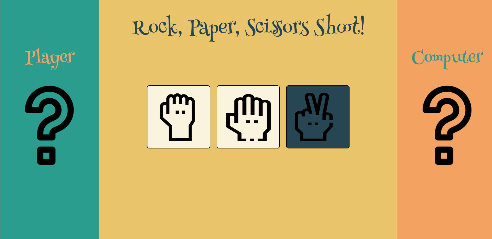

# Rock, Paper, Scissors Game

<a href="https://aaronsww.github.io/rpsGame/">Live Demonstartion.</a>

## Project Summary

This project implements the simple game of Rock, Paper, Scissors into a UI where you can play against a computer. This is the first project where I implemented JavaScript. I learned how to manipulate the DOM and deepened my knowledge on how functions work with each other.

### Rules of the game are as follows:

<ul>
    <li>Rock beats Scissors.</li>
    <li>Paper beats Rock.</li>
    <li>Scissors beats Paper.</li>
    <li>If you pick the same choice as the computer, it is a draw</li>
    <li>First one to reach five points wins!</li>
</ul>

### In Action

## Credits

All icons and outlines used were from <a href="https://www.flaticon.com/">this awesome webiste.</a>
And here's where I got the <a href="https://www.spoonflower.com/">image background</a> for the welcome page.
